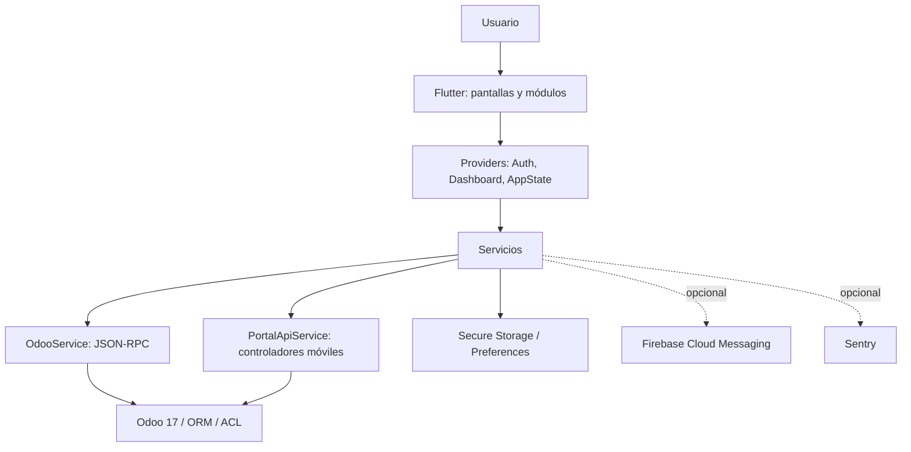

# Flutter CIC

Aplicación Flutter de CICancer para personal interno y usuarios de portal. Se conecta con Odoo mediante JSON-RPC y con los controladores móviles de `calidad_portal`; no contiene una base de datos de negocio propia.

## Qué permite hacer

- Iniciar y restaurar una sesión Odoo segura.
- Consultar o gestionar, según el perfil del servidor, incidencias, formación, documentos, reservas, planificación, salud, normativa, equipos, químicos, comunicaciones, proveedores, compras, mantenimiento y reclutamiento.
- Acceder a contenido de portal, nóminas, información entregada y publicaciones.
- Trabajar con adjuntos, PDF, códigos de barras, enlaces profundos y, cuando se configure en compilación, notificaciones Firebase.

La disponibilidad real se calcula en Odoo: ocultar una pantalla en Flutter no sustituye sus ACL ni sus reglas de registro.

## Tecnología confirmada

| Área | Implementación |
| --- | --- |
| Cliente | Flutter 3.44.9 / Dart 3.12.2 en el entorno analizado |
| SDK declarado | Dart `^3.11.5` |
| Estado | `provider` / `ChangeNotifier` |
| Backend | Odoo 17 mediante `odoo_rpc` y JSON-RPC |
| Persistencia local | `flutter_secure_storage` y `shared_preferences` |
| Observabilidad | Sentry opcional por `--dart-define` |
| Push | Firebase Cloud Messaging opcional por `--dart-define` |
| Plataformas | Android, iOS, macOS, Linux, Windows y web generadas por Flutter |

## Arquitectura resumida



## Inicio rápido

```bash
git clone git@github.com:Hugobf10/Flutter_cic.git
cd Flutter_cic/cic_odoo_app
flutter pub get
flutter run \
  --dart-define=ODOO_BASE_URL=https://servidor.example \
  --dart-define=ODOO_DATABASE=nombre_base
```

Usa únicamente una URL HTTPS válida y los datos que suministre la persona administradora de Odoo. La rama fuente de esta documentación es `main`, ya que el repositorio no expone una rama `staging` remota.

## Documentación

- [Guía rápida](docs/getting-started/QUICK_START.md)
- [Instalación](docs/getting-started/INSTALLATION.md)
- [Configuración](docs/getting-started/CONFIGURATION.md)
- [Manual de usuario](docs/user-guide/INTRODUCTION.md)
- [Arquitectura](docs/technical/ARCHITECTURE.md)
- [Integración Odoo](docs/technical/ODOO_INTEGRATION.md)
- [Desarrollo](docs/development/DEVELOPMENT.md)
- [Tests](docs/development/TESTING.md)
- [Build y publicación](docs/operations/BUILD_AND_RELEASE.md)
- [Resolución de problemas](docs/operations/TROUBLESHOOTING.md)
- [Auditoría documental](docs/DOCUMENTATION_AUDIT.md)

## Estado de verificación

Sobre el checkout limpio de `origin/main` analizado: `flutter analyze` finaliza sin incidencias. Los tests unitarios y de widget están documentados, pero las pruebas reales contra un Odoo desplegado no pueden verificarse sin credenciales y entorno autorizados.
