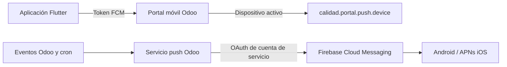

# Firebase y notificaciones push

## Estado y alcance

La base técnica está implementada, pero permanece **desactivada por defecto**.
No hay proyecto Firebase, configuración pública, cuenta de servicio ni credenciales
de Apple versionadas en este repositorio. No activar `PUSH_NOTIFICATIONS_ENABLED`
hasta completar la lista de aceptación de este documento.



Los valores Firebase incluidos en una app móvil identifican la aplicación: **no**
sustituyen a la credencial del servidor. El JSON de la cuenta de servicio solo
pertenece al entorno de Odoo.

## Lo ya preparado en código

- Flutter inicializa FCM únicamente cuando `PUSH_NOTIFICATIONS_ENABLED=true` y
  están presentes `FIREBASE_API_KEY`, `FIREBASE_APP_ID`,
  `FIREBASE_MESSAGING_SENDER_ID` y `FIREBASE_PROJECT_ID`.
- El token se registra en Odoo con `push_register`, se actualiza en cada
  renovación y se desactiva con `push_unregister` antes de cerrar sesión.
  Después, la app elimina el token local de FCM; el siguiente usuario del mismo
  dispositivo deberá obtener uno nuevo.
- Si la app se abre o recibe un aviso, recarga la bandeja de notificaciones.
  La apertura directa del registro concreto indicado por el payload no está
  implementada y no debe anunciarse como funcionalidad actual.
- Odoo guarda los dispositivos en `calidad.portal.push.device`, los desactiva
  al recibir errores FCM 404/410 y, tras este cambio, también al cerrar sesión.

## Requisitos externos pendientes

1. Decidir si se usa un proyecto Firebase existente o se crea uno nuevo. El
   repositorio no permite determinar su ID.
2. Iniciar sesión con una cuenta autorizada y seleccionar ese proyecto. En este
   equipo están verificados Node.js 22 y Firebase CLI 15.30; la autenticación
   y el proyecto activo no se han configurado porque requieren autorización.
3. Habilitar Firebase Cloud Messaging HTTP v1 y registrar las aplicaciones con
   estos identificadores actuales:

   | Plataforma | Identificador |
   | --- | --- |
   | Android | `com.cicancer.cic_odoo_app` |
   | iOS | `com.cicancer.cicOdooApp` |
   | macOS | `com.cicancer.cicOdooApp` |

4. Para iOS, habilitar **Push Notifications** y **Background Modes → Remote
   notifications** en el target Runner, crear/cargar la clave APNs en Firebase
   y validar en un iPhone físico. Es una configuración de Apple/Firebase que
   no puede completarse sin la cuenta correspondiente.

## Configuración de Odoo

Actualizar e instalar `calidad_portal` junto con los módulos que originan
notificaciones (`calidad_incidencias` y `reservas_servicios_avanzado_cic`,
cuando corresponda). En el entorno Python de Odoo instalar `google-auth`.

Configurar únicamente como secretos de despliegue:

```text
CIC_FCM_PROJECT_ID=identificador-del-proyecto
CIC_FCM_SERVICE_ACCOUNT_JSON={JSON completo de la cuenta de servicio}
```

La cuenta debe poder enviar mensajes FCM HTTP v1. No incluir su JSON en Git,
Notion, parámetros visibles de Odoo ni artefactos de compilación.

## Compilación de Flutter

El build con push debe recibir los valores públicos del proyecto Firebase:

```bash
flutter build apk --release \
  --dart-define=ODOO_BASE_URL=https://odoo.ejemplo.org \
  --dart-define=ODOO_DATABASE=base_produccion \
  --dart-define=PUSH_NOTIFICATIONS_ENABLED=true \
  --dart-define=FIREBASE_API_KEY=... \
  --dart-define=FIREBASE_APP_ID=... \
  --dart-define=FIREBASE_MESSAGING_SENDER_ID=... \
  --dart-define=FIREBASE_PROJECT_ID=...
```

En web añadir `FIREBASE_VAPID_KEY`. En una release que vaya a staging de forma
deliberada hay que pasar `ALLOW_STAGING_IN_RELEASE=true`; de otro modo el uso
de cualquiera de los valores de staging incluidos en el repositorio queda
bloqueado.

La firma Android sigue siendo obligatoria mediante `android/key.properties`.

## Preparación con Firebase CLI

No ejecutar estos comandos hasta que se conozca el proyecto autorizado. Se usa
la CLI mediante `npx`, nunca una cuenta o secreto compartido:

```bash
npx -y firebase-tools@latest login
npx -y firebase-tools@latest use <PROJECT_ID>
npx -y firebase-tools@latest apps:list --project <PROJECT_ID>
```

Si se debe crear un proyecto nuevo, acordar primero su identificador y entonces:

```bash
npx -y firebase-tools@latest projects:create <PROJECT_ID> --display-name "CIC"
```

La descarga de archivos de configuración, si finalmente se necesitan para una
plataforma, se realiza con `npx -y firebase-tools@latest apps:sdkconfig`, nunca
copiando secretos desde la consola. No se han añadido esos archivos porque no
existe un proyecto autorizado en el repositorio.

## Prueba de aceptación

1. Compilar e instalar Android, y después iOS, con los defines anteriores.
2. Iniciar sesión y aceptar permisos; comprobar el dispositivo activo en Odoo.
3. Crear una incidencia visible para ese usuario y verificar entrega.
4. Probar un recordatorio de reserva con la ventana prevista por el cron.
5. En un dispositivo compartido, validar: usuario A inicia sesión → recibe
   aviso → cierra sesión → usuario B inicia sesión. A no debe recibir avisos.
6. Abrir un aviso con la app en primer plano, segundo plano y terminada; debe
   actualizarse la bandeja. Documentar por separado cualquier navegación
   directa al registro que se decida implementar.
7. Desactivar el define push para verificar que la aplicación vuelve al modo
   seguro sin FCM.

## Reversión

Si una prueba falla, publicar sin `PUSH_NOTIFICATIONS_ENABLED=true` o retirar
el define de la compilación afectada. El servicio de Odoo no envía mensajes si
faltan sus secretos; los dispositivos pueden dejarse inactivos sin borrar el
histórico técnico.
