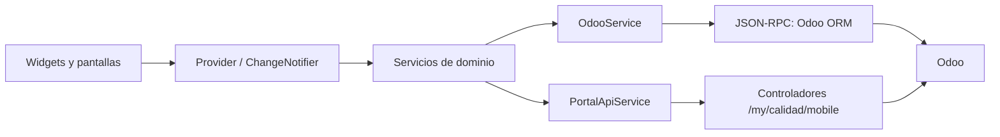

# Arquitectura

## Capas

La entrada es `lib/main.dart`. Inicializa Sentry si existe DSN, registra el handler push si está configurado, instala manejadores de error y publica `AuthProvider`, `DashboardProvider` y `AppStateProvider`. `AuthGate` restaura la sesión y decide entre splash, login, falta de acceso o `SuperAppShell`.

## Código

| Área | Ruta principal | Responsabilidad |
| --- | --- | --- |
| Bootstrap | `lib/main.dart` | Inicio, temas, l10n, errores y puerta de sesión |
| Módulos | `lib/app/core/` | Registro, permisos de navegación y router |
| Estado | `lib/providers/`, `lib/app/providers/` | Auth, dashboard, preferencias, ACL y notificaciones |
| Servicios | `lib/services/` | Odoo, adjuntos, RPC, logger, push, enlaces y OCR |
| Funcionalidad | `lib/features/`, `lib/screens/` | Pantallas de dominio |
| Aspecto | `lib/theme/`, `lib/app/ui/`, `lib/widgets/` | Tema, movimiento y componentes reutilizables |
| Idiomas | `lib/l10n/` | ARB español/inglés y código generado |

## Navegación y estado

La navegación utiliza `Navigator` y `MaterialPageRoute`, no un paquete router declarativo. `ModuleNavigation.openModule` rechaza abrir módulos que el cliente considere no visibles y `ModuleRouter` materializa el widget. Esta capa mejora la UX, pero no es un control de seguridad.

## Errores y reintentos

`RpcExecutor` aplica timeout y hasta tres reintentos escalonados solo cuando la llamada se declara de lectura. Crear, escribir, confirmar, recibir, cancelar y acciones de portal no se reintentan automáticamente: un timeout puede haber producido un efecto en Odoo.

## Dependencias relevantes

La lista completa, con versiones declaradas, está en `cic_odoo_app/pubspec.yaml`. Destacan `odoo_rpc`, Provider, Secure Storage, HTTP, Sentry, Firebase, selector de archivos, visor/generador PDF, cámara/escáner, SVG, enlaces profundos y permisos de dispositivo.
